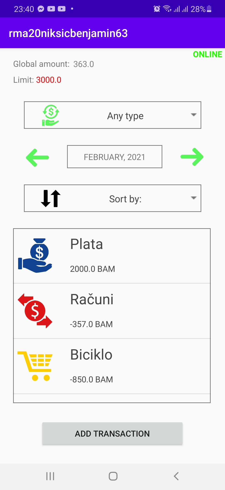
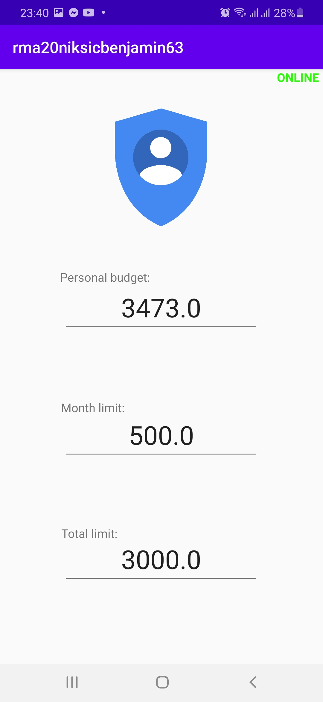
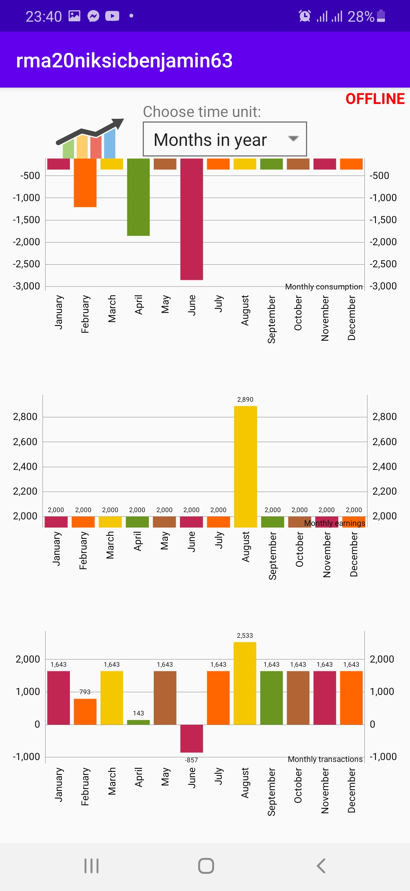

<!-- PROJECT LOGO -->
 

  

  <h3 align="center">Life transactions manager</h3>

<!-- ABOUT THE PROJECT -->
## About The Project

Project made from 0 for faculty exam as part of course Mobile Application Development.

Application handles with API by which we store, modify and get our transactions. 

Local database is implemented and is important for the purpose of allowing application to work in offline mode.

App supports 5 different types of transactions by which we can track our consumptions and earnings daily, monthly and even yearly.

By sliding we are switching fragment layouts from pictures. On last picture we can track our transactions with help of graph.

### Built With

This section is list of languages and frameworks that project uses:
* [Java]()
* [Android]()
